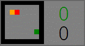
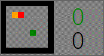
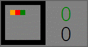
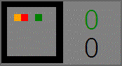
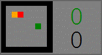
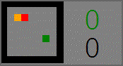
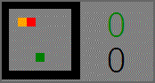

# Snake_evolution_strategy
Evolving neural structure for snake control

I am impressed by Google Research's work on [Weight Agnostic Neural Networks and how to optimize them](https://ai.googleblog.com/2019/08/exploring-weight-agnostic-neural.html). For better understanding, I want to implement my findings in the chosen environment: a snake game. Below you can see the main milestones of the project. When the project is close to completion, I will present visual demonstrations of the behavior of the agents being created and describe more project details.

* Create an environment for simulations;
    * find ways to encode information about the game state;
    * implement them;
* Write an optimization procedure based on evolutionary strategies for tests;
* Test the optimizer on a simple agent;
    * Conduct experiments and find out how much intelligent behavior can be achieved from an agent with a small number of neurons;
    * This point was not originally planned, but it turned out that the task of surviving in the environment can be conditionally divided into two smaller ones: perception of the environment and decision-making. Evolution solves its tasks too slowly, and the project is mainly focused on the second part of the task. It was decided to develop an analogue of visual cortex to speed up optimization - the researchers in the original paper also paid attention to this and opted to use [Variational Autoencoder](https://en.wikipedia.org/wiki/Variational_autoencoder) for the solution. I will follow their example;
* Before engaging in neuroevolution, consider reducing the impact of **the sparse reward problem**; *solved(?) by using the curiosity mechanism*
    * another problem arose: the relative scale of the rewards. Short description: the rewards for a newly explored state should not be as large as for a block of food eaten. But what is the right ratio? 5 new states and 1 block of food? 10? So far I'll create a convenient table for future tests, but right now I'll focus on higher priorities;
* Write a basic neuroevolution functionality;
* Implement a way to visualize the neural architectures created within the neuroevolution system;
* Create animations of agent behavior and relate them to their neural architectures;
* Devise ways to present the work accomplished in an attractive manner.

# Demonstration
## top-10 Bare_minimum agents (8 neurons)
Agents are presented in order of increasing loss-function: from left to right from top to bottom.
|  
<b>iter_584, ind_6</b>
 |  
<b>iter_148, ind_15</b>
 |  
<b>iter_392, ind_9</b>
 |  
<b>iter_36, ind_16</b>
 |  
<b>iter_384, ind_3</b>
 |
|:--:|:--:|:--:|:--:|:--:|
|  
<b>iter_404, ind_11</b>
 |  
<b>iter_935, ind_6</b>
 |  
<b>iter_967, ind_2</b>
 |  
<b>iter_910, ind_12</b>
 |  
<b>iter_943, ind_11</b>
 |

Special thanks for Adam Gaier and David Ha
